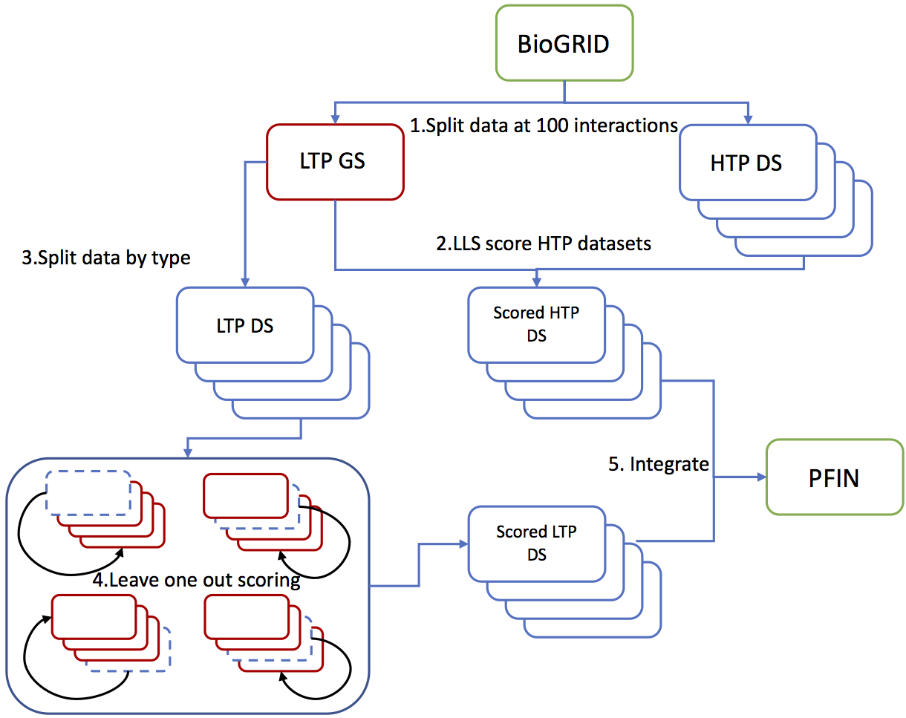

# ssnet
single source integration of probabilistic functional integrated networks

ssnet takes a BioGRID file of functional interaction data for a species and produces a probabilitistic functional integrated network using the method of:

Aoesha Alsobhe, James Skelton, Matthew Pocock, Simon J. Cockell, Anil Wipat1 and Katherine James (2020) Integration of probabilistic functional integrated networks from a single database source. 

Usage: ssnet inputfile d-value taxid htp_threshold

SSnet currently uses BioGRID data in tab2 format (https://wiki.thebiogrid.org/doku.php/downloads)

**Integration methodology**

Datatsets are split by PubMED identifier and those with number of interactions below the htp_threshold are considered low-throughtput gold standard datasets. Confidence scores were calculated using the methods developed by Lee and colleagues^1, that calculates a log-likelihood score for each dataset:

where,  and  represent the frequencies of linkages L observed in a dataset E between genes that are linked and not not linked in the gold standard, respectively, and,  and  represent the prior expectation of linkages between genes that are linked and not not linked in the gold standard, respectively. 

The gold standard data is then scored using an iterative LTP scoring method in which each LTP data type is scored as a single dataset using the remaining LTP types as gold standard. HTP and LTP dataset scores are then integrated using the Lee method using the D value chosen:

 
 
 where  is the highest confidence score and  the lowest confidence score of a set of  datasets.

LEE REFERENCE HERE

