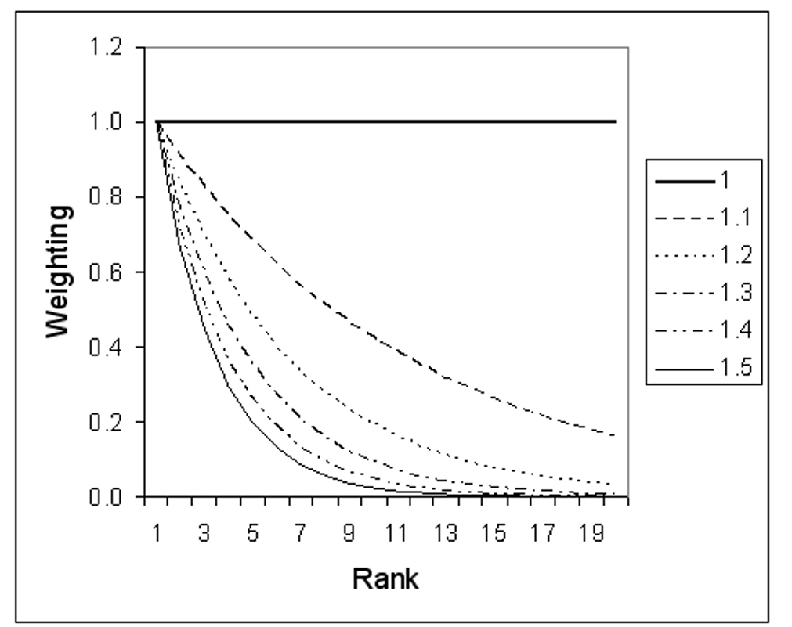
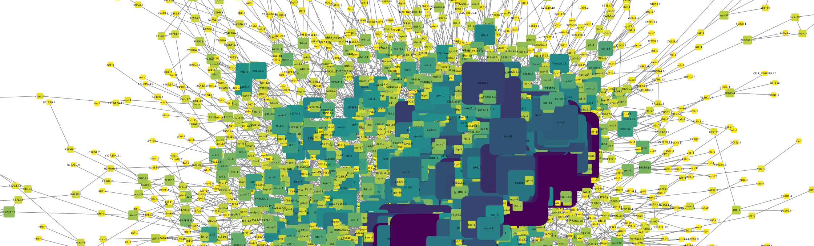

# ssnet
Single source integration of probabilistic functional integrated networks

Ssnet takes a BioGRID file of functional interaction data for a species and produces a probabilitistic functional integrated network using the method of:

Integration of probabilistic functional networks without an external Gold Standard. (https://biorxiv.org/cgi/content/short/2021.10.01.462727v1)

Usage: ``` java -jar "ssnet.jar" inputfile d-value taxid htp_threshold ```

Input file: ssnet currently uses BioGRID data in tab2 format (https://wiki.thebiogrid.org/doku.php/downloads)

Taxid, for example:
* Yeast 559292 (4932 up to BioGRID V72)
* Human 9606
* Mouse 10090

D-value: value for weighted sum, 1.0 gives a sum, higher values upweight datasets based on LLS confidence score (see below). Default 1.0.

HTP threshold: Threshold to split BioGRID data into high-throughput and low-throughput studies. Default 100.

**Integration methodology**

<p align="center">

</p>

Datatsets are split by PubMED identifier and those with number of interactions below the htp_threshold are considered low-throughtput gold standard datasets. Confidence scores were calculated using the methods developed by Lee and colleagues<sup>1</sup>, that calculates a log-likelihood score for each dataset:


where,  and  represent the frequencies of linkages L observed in a dataset E between genes that are linked and not not linked in the gold standard, respectively, and,  and  represent the prior expectation of linkages between genes that are linked and not not linked in the gold standard, respectively. 

The gold standard data is then scored using an iterative LTP scoring method in which each LTP data type is scored as a single dataset using the remaining LTP types as gold standard. HTP and LTP dataset scores are then integrated using the Lee method using the D value chosen:

 
 
 where  is the highest confidence score and  the lowest confidence score of a set of  datasets.


<p align="center">

</p>


**Outputs**

The main output is a tab delimited network file in the format ```NodeA NodeB Score```, which can be uploaded in Cyctoscape or other network visualisation software. 

The package also outputs dataset extraction details and loglikelihood scores for HTP and LTP datasets. 

Example ssNET outputs for yeast can be found at: https://figshare.com/projects/Yeast_ssNet/114366

1. Lee I, Date SV, Adai AT, Marcotte EM. A probabilistic functional network of yeast genes. Science. 2004 Nov 26;306(5701):1555-8. doi: 10.1126/science.1099511. PMID: 15567862.

**License**

GPL v3

<p align="center">

</p>


